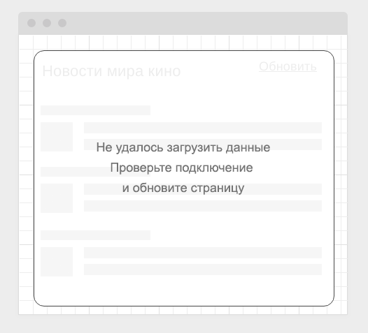

#### Deployment: <a href="https://sergius92739.github.io/ahj-12.1-workers_loading_styling_frontend/">Github Pages</a>
#### Frontend: <a href="https://github.com/Sergius92739/ahj-12.1-workers_loading_styling_frontend">Repository</a>
#### Server: <a href="https://ahj1.sergem.xyz/">Облачный сервер</a>

---

### Loading Styling

#### Легенда

Сейчас модно показывать интерфейсы загрузки вроде следующего:

#### Описание

Реализуйте подобный интерфейс, закешировав статические ресурсы и показывая данный внешний вид до момента загрузки данных.

Обратите внимание, даже если у пользователя нет подключения, страница всё равно должна отображаться, но в режиме "загрузки" и после неудачной попытки соединения переходить в режим:

Для эмуляции задержки можете самостоятельно написать middleware для koa, или посмотреть на существующие вроде [koa-slow](https://github.com/bahmutov/koa-slow)

Напоминаем, что для кэширования вы можете воспользоваться плагином Workbox.
